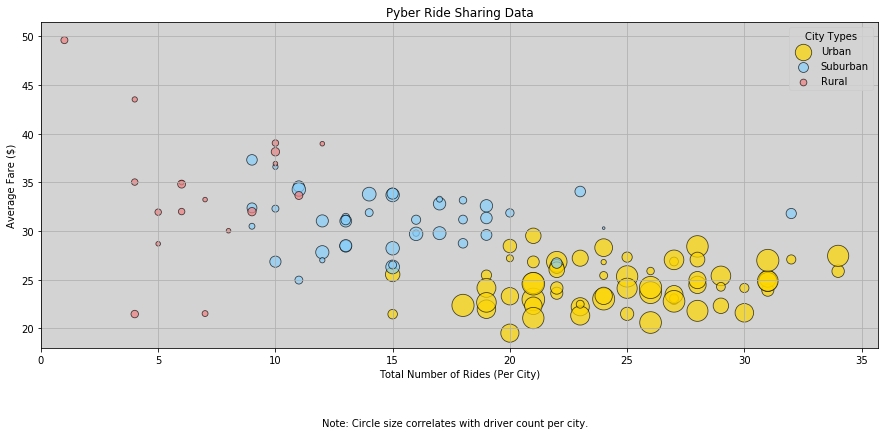
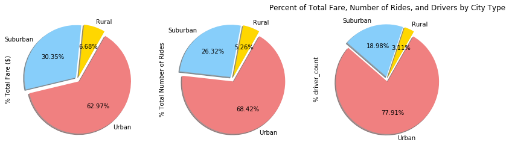

# Analysis
    Observed Trend 1: 
    Urban cities tend to have the most drivers and total number of rides, as well as the lowest average fare of the three city types.
    
    Observed Trend 2: 
    Rural cities have the fewest number of rides and drivers, and the widest average fare range.
    
    Observed Trend 3: 
    Urban cities make up a larger portion of total drivers than total number of rides, suggesting there are fewer rides per driver in those cities than in rural and suburban cities.


```python
import pandas as pd
import numpy as np
import matplotlib.pyplot as plt
```


```python
cities = pd.read_csv("city_data.csv")
rides = pd.read_csv("ride_data.csv")
```


```python
cities.head()
```


<div>
<style>
    .dataframe thead tr:only-child th {
        text-align: right;
    }

    .dataframe thead th {
        text-align: left;
    }

    .dataframe tbody tr th {
        vertical-align: top;
    }
</style>
<table border="1" class="dataframe">
  <thead>
    <tr style="text-align: right;">
      <th></th>
      <th>city</th>
      <th>driver_count</th>
      <th>type</th>
    </tr>
  </thead>
  <tbody>
    <tr>
      <th>0</th>
      <td>Kelseyland</td>
      <td>63</td>
      <td>Urban</td>
    </tr>
    <tr>
      <th>1</th>
      <td>Nguyenbury</td>
      <td>8</td>
      <td>Urban</td>
    </tr>
    <tr>
      <th>2</th>
      <td>East Douglas</td>
      <td>12</td>
      <td>Urban</td>
    </tr>
    <tr>
      <th>3</th>
      <td>West Dawnfurt</td>
      <td>34</td>
      <td>Urban</td>
    </tr>
    <tr>
      <th>4</th>
      <td>Rodriguezburgh</td>
      <td>52</td>
      <td>Urban</td>
    </tr>
  </tbody>
</table>
</div>


```python
len(cities)
```


    126


```python
#cities['city'].value_counts()
cities.loc[cities['city'] == 'Port James']
```


<div>
<style>
    .dataframe thead tr:only-child th {
        text-align: right;
    }

    .dataframe thead th {
        text-align: left;
    }

    .dataframe tbody tr th {
        vertical-align: top;
    }
</style>
<table border="1" class="dataframe">
  <thead>
    <tr style="text-align: right;">
      <th></th>
      <th>city</th>
      <th>driver_count</th>
      <th>type</th>
    </tr>
  </thead>
  <tbody>
    <tr>
      <th>84</th>
      <td>Port James</td>
      <td>15</td>
      <td>Suburban</td>
    </tr>
    <tr>
      <th>100</th>
      <td>Port James</td>
      <td>3</td>
      <td>Suburban</td>
    </tr>
  </tbody>
</table>
</div>


```python
cities = cities.drop(cities.index[100])
```


```python
len(cities)
```


    125


```python
cities.loc[cities['city'] == 'Port James']
```


<div>
<style>
    .dataframe thead tr:only-child th {
        text-align: right;
    }

    .dataframe thead th {
        text-align: left;
    }

    .dataframe tbody tr th {
        vertical-align: top;
    }
</style>
<table border="1" class="dataframe">
  <thead>
    <tr style="text-align: right;">
      <th></th>
      <th>city</th>
      <th>driver_count</th>
      <th>type</th>
    </tr>
  </thead>
  <tbody>
    <tr>
      <th>84</th>
      <td>Port James</td>
      <td>15</td>
      <td>Suburban</td>
    </tr>
  </tbody>
</table>
</div>


```python
rides.head()
```


<div>
<style>
    .dataframe thead tr:only-child th {
        text-align: right;
    }

    .dataframe thead th {
        text-align: left;
    }

    .dataframe tbody tr th {
        vertical-align: top;
    }
</style>
<table border="1" class="dataframe">
  <thead>
    <tr style="text-align: right;">
      <th></th>
      <th>city</th>
      <th>date</th>
      <th>fare</th>
      <th>ride_id</th>
    </tr>
  </thead>
  <tbody>
    <tr>
      <th>0</th>
      <td>Sarabury</td>
      <td>2016-01-16 13:49:27</td>
      <td>38.35</td>
      <td>5403689035038</td>
    </tr>
    <tr>
      <th>1</th>
      <td>South Roy</td>
      <td>2016-01-02 18:42:34</td>
      <td>17.49</td>
      <td>4036272335942</td>
    </tr>
    <tr>
      <th>2</th>
      <td>Wiseborough</td>
      <td>2016-01-21 17:35:29</td>
      <td>44.18</td>
      <td>3645042422587</td>
    </tr>
    <tr>
      <th>3</th>
      <td>Spencertown</td>
      <td>2016-07-31 14:53:22</td>
      <td>6.87</td>
      <td>2242596575892</td>
    </tr>
    <tr>
      <th>4</th>
      <td>Nguyenbury</td>
      <td>2016-07-09 04:42:44</td>
      <td>6.28</td>
      <td>1543057793673</td>
    </tr>
  </tbody>
</table>
</div>


```python
len(rides)
```


    2375


```python
cities_rides = pd.merge(rides, cities, on="city", how="left")
cities_rides.head()
```


<div>
<style>
    .dataframe thead tr:only-child th {
        text-align: right;
    }

    .dataframe thead th {
        text-align: left;
    }

    .dataframe tbody tr th {
        vertical-align: top;
    }
</style>
<table border="1" class="dataframe">
  <thead>
    <tr style="text-align: right;">
      <th></th>
      <th>city</th>
      <th>date</th>
      <th>fare</th>
      <th>ride_id</th>
      <th>driver_count</th>
      <th>type</th>
    </tr>
  </thead>
  <tbody>
    <tr>
      <th>0</th>
      <td>Sarabury</td>
      <td>2016-01-16 13:49:27</td>
      <td>38.35</td>
      <td>5403689035038</td>
      <td>46</td>
      <td>Urban</td>
    </tr>
    <tr>
      <th>1</th>
      <td>South Roy</td>
      <td>2016-01-02 18:42:34</td>
      <td>17.49</td>
      <td>4036272335942</td>
      <td>35</td>
      <td>Urban</td>
    </tr>
    <tr>
      <th>2</th>
      <td>Wiseborough</td>
      <td>2016-01-21 17:35:29</td>
      <td>44.18</td>
      <td>3645042422587</td>
      <td>55</td>
      <td>Urban</td>
    </tr>
    <tr>
      <th>3</th>
      <td>Spencertown</td>
      <td>2016-07-31 14:53:22</td>
      <td>6.87</td>
      <td>2242596575892</td>
      <td>68</td>
      <td>Urban</td>
    </tr>
    <tr>
      <th>4</th>
      <td>Nguyenbury</td>
      <td>2016-07-09 04:42:44</td>
      <td>6.28</td>
      <td>1543057793673</td>
      <td>8</td>
      <td>Urban</td>
    </tr>
  </tbody>
</table>
</div>


```python
len(cities_rides)
```


    2375


```python
summary = cities_rides.groupby(['city', 'type', 'driver_count']).agg({'fare': ['mean', 'count']}).rename(columns={'mean':'Average Fare ($)', 'count':'Total Number of Rides'})
summary.columns=summary.columns.droplevel(0)
summary = summary.reset_index()
summary['Average Fare ($)'] = round(summary['Average Fare ($)'], 2)
summary.head()
```


<div>
<style>
    .dataframe thead tr:only-child th {
        text-align: right;
    }

    .dataframe thead th {
        text-align: left;
    }

    .dataframe tbody tr th {
        vertical-align: top;
    }
</style>
<table border="1" class="dataframe">
  <thead>
    <tr style="text-align: right;">
      <th></th>
      <th>city</th>
      <th>type</th>
      <th>driver_count</th>
      <th>Average Fare ($)</th>
      <th>Total Number of Rides</th>
    </tr>
  </thead>
  <tbody>
    <tr>
      <th>0</th>
      <td>Alvarezhaven</td>
      <td>Urban</td>
      <td>21</td>
      <td>23.93</td>
      <td>31</td>
    </tr>
    <tr>
      <th>1</th>
      <td>Alyssaberg</td>
      <td>Urban</td>
      <td>67</td>
      <td>20.61</td>
      <td>26</td>
    </tr>
    <tr>
      <th>2</th>
      <td>Anitamouth</td>
      <td>Suburban</td>
      <td>16</td>
      <td>37.32</td>
      <td>9</td>
    </tr>
    <tr>
      <th>3</th>
      <td>Antoniomouth</td>
      <td>Urban</td>
      <td>21</td>
      <td>23.62</td>
      <td>22</td>
    </tr>
    <tr>
      <th>4</th>
      <td>Aprilchester</td>
      <td>Urban</td>
      <td>49</td>
      <td>21.98</td>
      <td>19</td>
    </tr>
  </tbody>
</table>
</div>


```python
#summary.loc[summary['Total Number of Rides'] == 32]
#sum(summary['Total Number of Rides'])
summary['Total Number of Rides'].sum()
```


    2375


```python
types = summary['type'].unique()
colors = ['gold', 'lightskyblue', 'lightcoral']

for i in range(len(types)):
    plt.scatter(x=summary[summary['type']==types[i]]['Total Number of Rides'].values,
                y=summary[summary['type']==types[i]]['Average Fare ($)'].values,
                s = 7*summary[summary['type']==types[i]]['driver_count'].values,
                c = colors[i], label = types[i],
                alpha = .7, edgecolor = 'black', linewidth = .8)

plt.xlabel("Total Number of Rides (Per City)")
plt.ylabel("Average Fare ($)")
plt.title("Pyber Ride Sharing Data")
plt.xlim(0)
plt.legend(title="City Types")
plt.text(12, 10, "Note: Circle size correlates with driver count per city.")
plt.grid()

plt.gcf().set_size_inches(15, 6)
plt.rcParams['axes.facecolor'] = 'lightgrey'
plt.show()
```





```python
#x = []
#y = []
#color = []
#area = []

#for data in summary:
#    x.append(data[4])
#    y.append(data[3])
#    color.append(data[])
    
```


```python
summary['Total Fare ($)'] = summary['Average Fare ($)'] * summary['Total Number of Rides']
summary.head()
```


<div>
<style>
    .dataframe thead tr:only-child th {
        text-align: right;
    }

    .dataframe thead th {
        text-align: left;
    }

    .dataframe tbody tr th {
        vertical-align: top;
    }
</style>
<table border="1" class="dataframe">
  <thead>
    <tr style="text-align: right;">
      <th></th>
      <th>city</th>
      <th>type</th>
      <th>driver_count</th>
      <th>Average Fare ($)</th>
      <th>Total Number of Rides</th>
      <th>Total Fare ($)</th>
    </tr>
  </thead>
  <tbody>
    <tr>
      <th>0</th>
      <td>Alvarezhaven</td>
      <td>Urban</td>
      <td>21</td>
      <td>23.93</td>
      <td>31</td>
      <td>741.83</td>
    </tr>
    <tr>
      <th>1</th>
      <td>Alyssaberg</td>
      <td>Urban</td>
      <td>67</td>
      <td>20.61</td>
      <td>26</td>
      <td>535.86</td>
    </tr>
    <tr>
      <th>2</th>
      <td>Anitamouth</td>
      <td>Suburban</td>
      <td>16</td>
      <td>37.32</td>
      <td>9</td>
      <td>335.88</td>
    </tr>
    <tr>
      <th>3</th>
      <td>Antoniomouth</td>
      <td>Urban</td>
      <td>21</td>
      <td>23.62</td>
      <td>22</td>
      <td>519.64</td>
    </tr>
    <tr>
      <th>4</th>
      <td>Aprilchester</td>
      <td>Urban</td>
      <td>49</td>
      <td>21.98</td>
      <td>19</td>
      <td>417.62</td>
    </tr>
  </tbody>
</table>
</div>


```python
pie_data = summary.groupby(['type']).agg({'Total Fare ($)': 'sum', 'Total Number of Rides': 'sum', 'driver_count': 'sum'}).rename(columns={'Total Fare ($)':'% Total Fare ($)', 'Total Number of Rides':'% Total Number of Rides', 'driver_count':'% driver_count'})
#pie_data = pie_data.reset_index()
#pie_data['Total Fare ($)'] = pie_data['Total Fare ($)']/pie_data['Total Fare ($)'].sum()
#pie_data['Total Number of Rides'] = pie_data['Total Number of Rides']/pie_data['Total Number of Rides'].sum()
#pie_data['driver_count'] = pie_data['driver_count']/pie_data['driver_count'].sum()
percent_of_total = lambda x: round(100*(x/x.sum()), 2)
percent = pie_data.apply(percent_of_total)
percent
```


<div>
<style>
    .dataframe thead tr:only-child th {
        text-align: right;
    }

    .dataframe thead th {
        text-align: left;
    }

    .dataframe tbody tr th {
        vertical-align: top;
    }
</style>
<table border="1" class="dataframe">
  <thead>
    <tr style="text-align: right;">
      <th></th>
      <th>% Total Fare ($)</th>
      <th>% Total Number of Rides</th>
      <th>% driver_count</th>
    </tr>
    <tr>
      <th>type</th>
      <th></th>
      <th></th>
      <th></th>
    </tr>
  </thead>
  <tbody>
    <tr>
      <th>Rural</th>
      <td>6.68</td>
      <td>5.26</td>
      <td>3.11</td>
    </tr>
    <tr>
      <th>Suburban</th>
      <td>30.35</td>
      <td>26.32</td>
      <td>18.98</td>
    </tr>
    <tr>
      <th>Urban</th>
      <td>62.97</td>
      <td>68.42</td>
      <td>77.91</td>
    </tr>
  </tbody>
</table>
</div>


```python
percent.plot.pie(subplots=True, legend=False,colors = colors, figsize=(13,4), shadow=True, startangle=60, autopct='%.2f%%', explode=(0.05, 0.05, 0.05))
plt.title("Percent of Total Fare, Number of Rides, and Drivers by City Type")
plt.show()
```





```python

```
